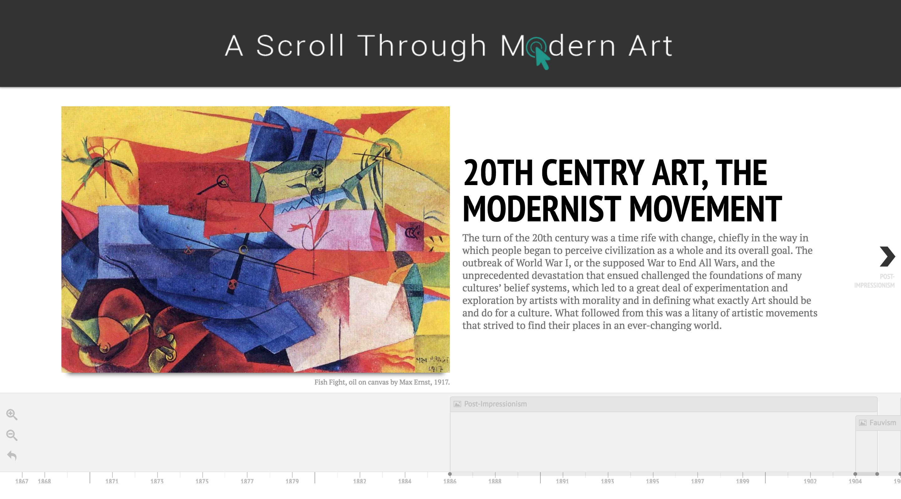
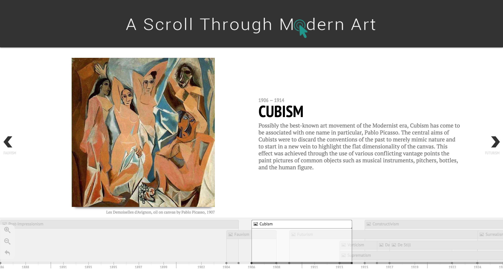
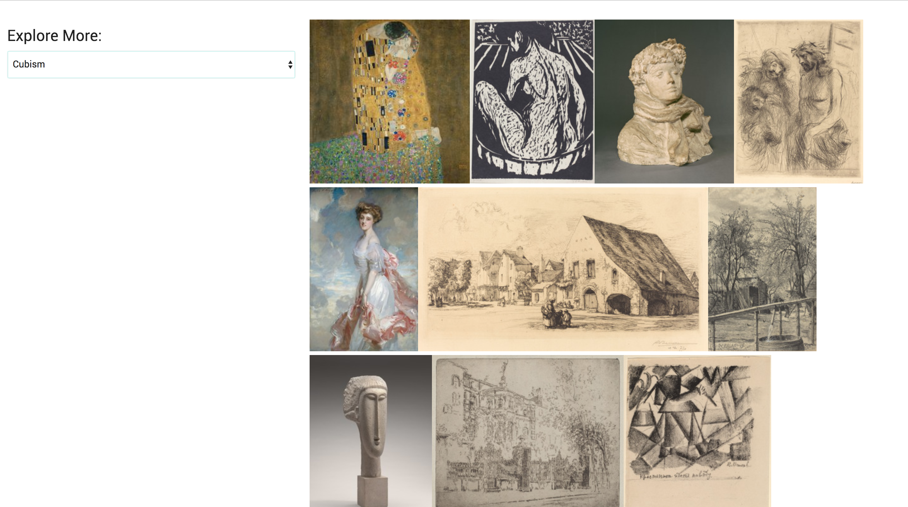

# A Scroll Through Modern Art

A Scroll Through Modern Art is a web application that timelines the modern
art movement.  It highlights how the arts evolved as a response to the surrounding world during that era.

## Built With

* [Materialize](http://materializecss.com/)
* [JavaScript](https://www.javascript.com/)
* [TimelineJS](https://timeline.knightlab.com/)

## Links

* [Web App](https://astma-7d413.firebaseapp.com/)
* [Live Demo](https://www.youtube.com/watch?v=OZcWhkOkhkM&t=26s)

## Images

## Built By

* **Chelcie Britt** - (https://github.com/chelciebritt)

## License

This project is licensed under the MIT License - see the [LICENSE.md](LICENSE.md) file for details
